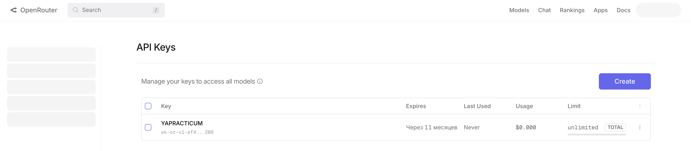
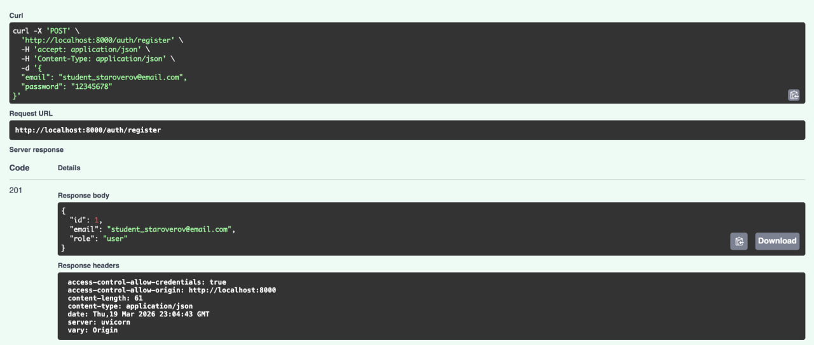
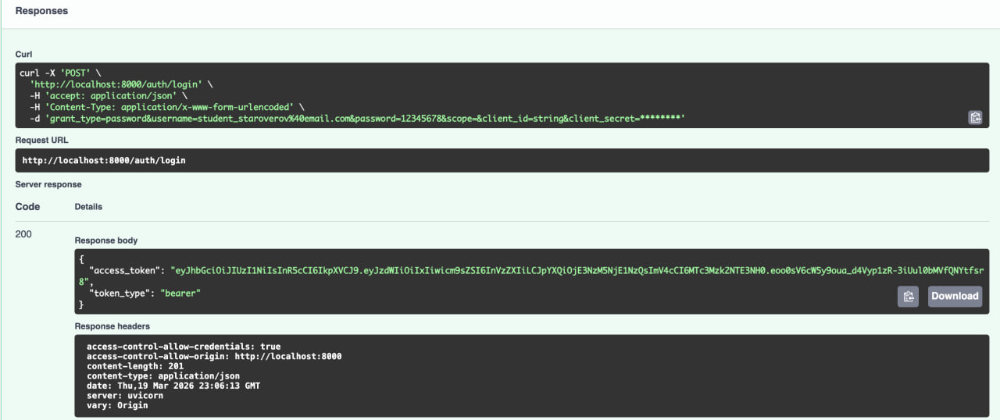
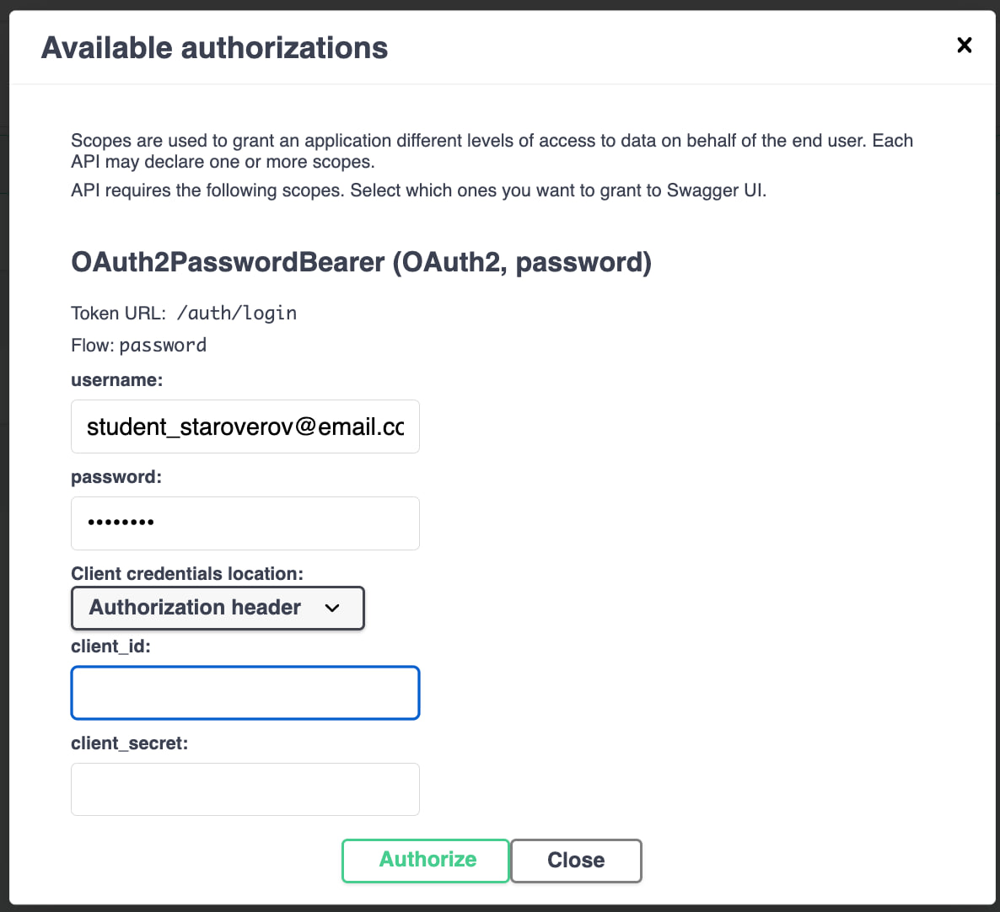
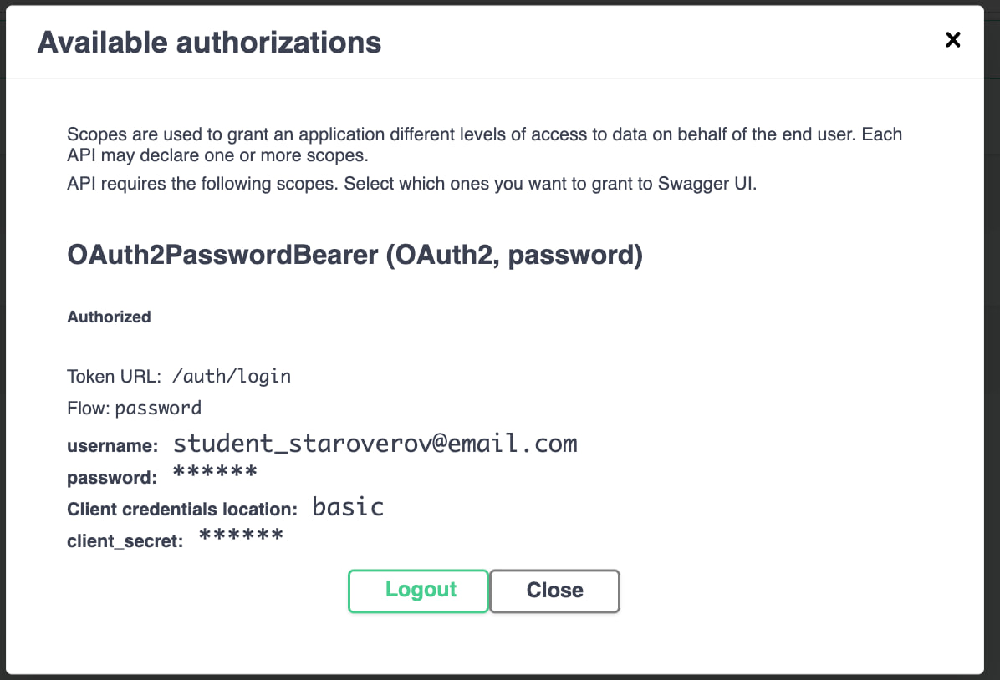
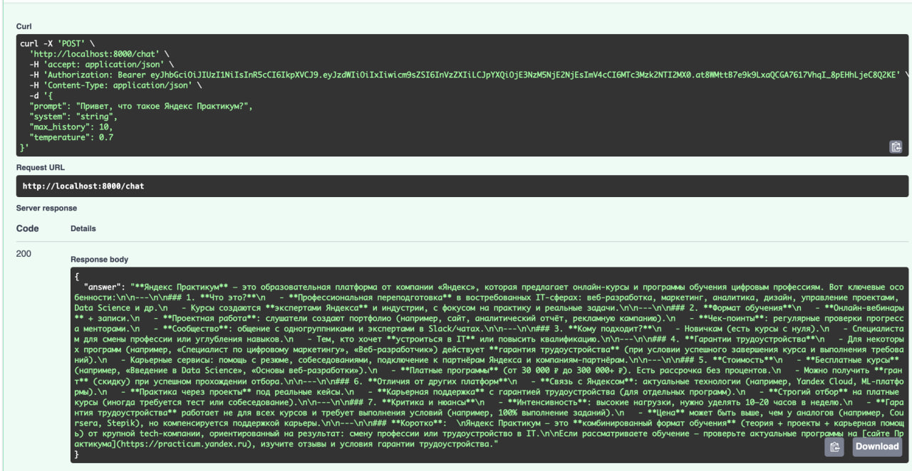
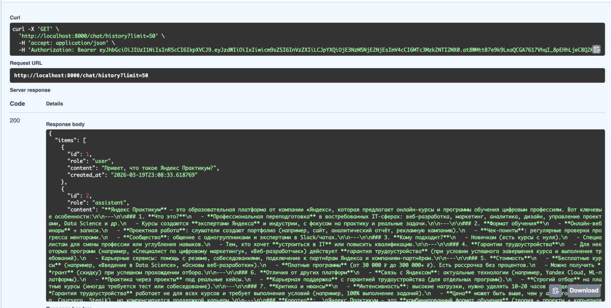
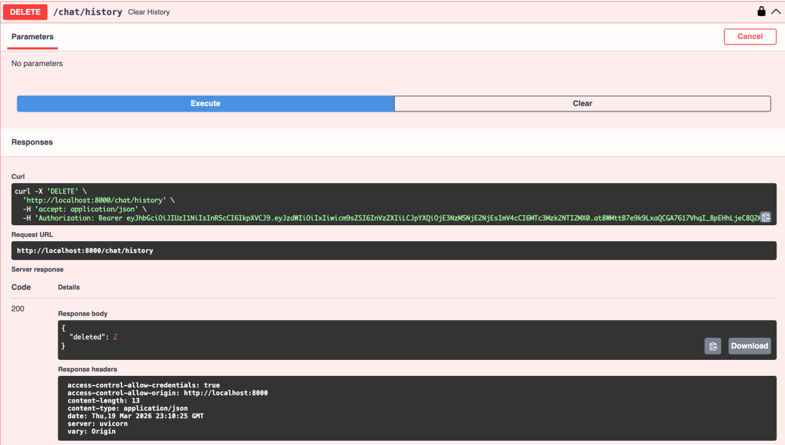
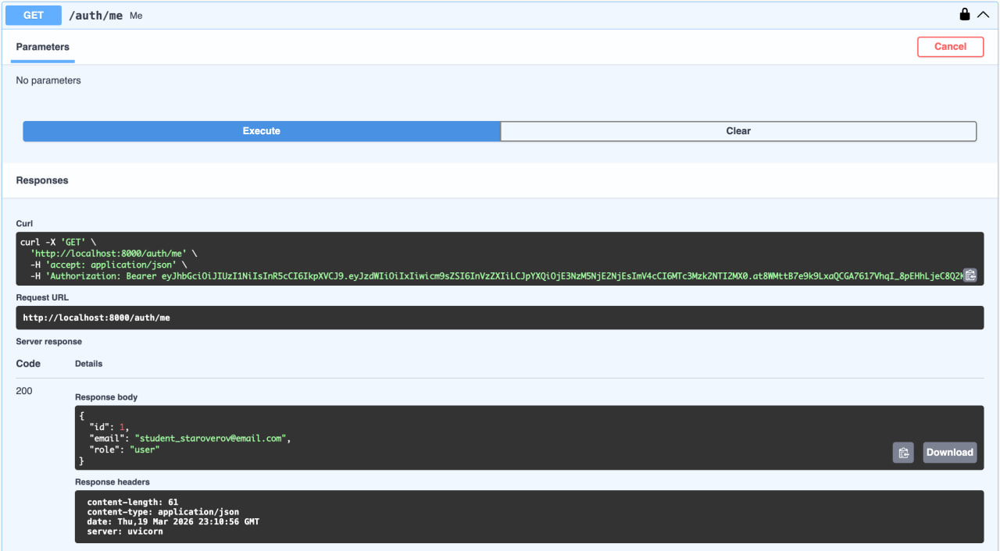

# llm-p — Защищённый API для работы с LLM

Серверное приложение на FastAPI, предоставляющее защищённый API для взаимодействия с большой языковой моделью (LLM) через сервис OpenRouter. Реализована аутентификация и авторизация пользователей с использованием JWT, хранение данных в SQLite, разделение ответственности между слоями приложения.

## Стек технологий

- **Python 3.11+**
- **FastAPI** — асинхронный веб-фреймворк
- **SQLAlchemy** + **aiosqlite** — асинхронная работа с SQLite
- **Pydantic v2** — валидация данных
- **python-jose** — генерация и верификация JWT
- **passlib** + **bcrypt** — хеширование паролей
- **httpx** — HTTP-клиент для запросов к OpenRouter
- **uv** — управление зависимостями и виртуальным окружением

## Архитектура

```
API (routes) → UseCases (бизнес-логика) → Repositories (доступ к данным) → DB
                                        → Services (внешние API)
```

```
app/
├── main.py                    # Точка входа FastAPI
├── core/
│   ├── config.py              # Конфигурация (env → Settings)
│   ├── security.py            # JWT, хеширование паролей
│   └── errors.py              # Доменные исключения
├── db/
│   ├── base.py                # DeclarativeBase
│   ├── session.py             # Async engine и sessionmaker
│   └── models.py              # ORM-модели (User, ChatMessage)
├── schemas/
│   ├── auth.py                # Регистрация, токены
│   ├── user.py                # Публичная модель пользователя
│   └── chat.py                # Запросы и ответы LLM
├── repositories/
│   ├── users.py               # Доступ к таблице users
│   └── chat_messages.py       # Доступ к истории чатов
├── services/
│   └── openrouter_client.py   # Клиент OpenRouter / LLM
├── usecases/
│   ├── auth.py                # Регистрация, логин, профиль
│   └── chat.py                # Логика общения с LLM
└── api/
    ├── deps.py                # Dependency Injection
    ├── routes_auth.py         # /auth/*
    └── routes_chat.py         # /chat/*
```

## Установка и запуск

### 1. Установка uv

```bash
pip install uv
```

### 2. Инициализация проекта

```bash
uv init
cd llm-p
```

### 3. Создание виртуального окружения

```bash
uv venv
```

### 4. Активация виртуального окружения

```bash
# MacOS / Linux
source .venv/bin/activate

# Windows
.venv\Scripts\activate.bat
```

### 5. Установка зависимостей

```bash
uv pip install -r <(uv pip compile pyproject.toml)
```

### 6. Настройка переменных окружения

Скопируйте `.env.example` в `.env` и заполните `OPENROUTER_API_KEY`:

```bash
cp .env.example .env
```

Пример `.env`:

```
APP_NAME=llm-p
ENV=local

JWT_SECRET=change_me_super_secret
JWT_ALG=HS256
ACCESS_TOKEN_EXPIRE_MINUTES=60

SQLITE_PATH=./app.db

OPENROUTER_API_KEY=<ваш_ключ>
OPENROUTER_BASE_URL=https://openrouter.ai/api/v1
OPENROUTER_MODEL=stepfun/step-3.5-flash:free
OPENROUTER_SITE_URL=https://example.com
OPENROUTER_APP_NAME=llm-fastapi-openrouter
```

API-ключ можно получить на [openrouter.ai](https://openrouter.ai/).

### 7. Запуск приложения

```bash
uv run uvicorn app.main:app --reload --host 0.0.0.0 --port 8000
```

После запуска Swagger UI доступен по адресу: [http://localhost:8000/docs](http://localhost:8000/docs)

### 8. Проверка кода линтером

```bash
ruff check
```

Результат: `All checks passed!`

## API-эндпоинты

| Метод    | URL              | Описание              | Авторизация |
|----------|------------------|-----------------------|-------------|
| POST     | /auth/register   | Регистрация           | —           |
| POST     | /auth/login      | Логин, выдача JWT     | —           |
| GET      | /auth/me         | Профиль пользователя  | Bearer JWT  |
| POST     | /chat            | Запрос к LLM          | Bearer JWT  |
| GET      | /chat/history    | История диалога       | Bearer JWT  |
| DELETE   | /chat/history    | Очистка истории       | Bearer JWT  |
| GET      | /health          | Проверка статуса      | —           |

## Демонстрация работы

### OpenRouter — API-ключ



### Регистрация пользователя — POST /auth/register

Регистрация с email `student_staroverov@email.com`:



### Логин и получение JWT — POST /auth/login



### Авторизация через Swagger (кнопка Authorize)



### Успешная авторизация



### Запрос к LLM — POST /chat



### История диалога — GET /chat/history



### Очистка истории — DELETE /chat/history



### Профиль пользователя — GET /auth/me


